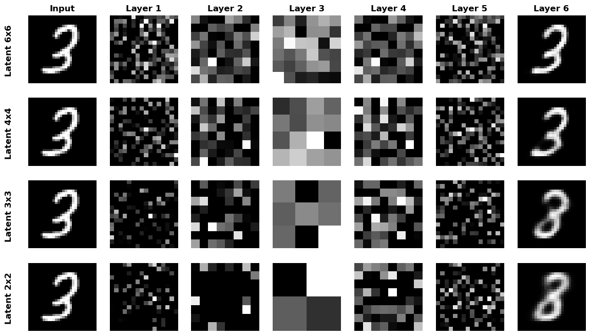
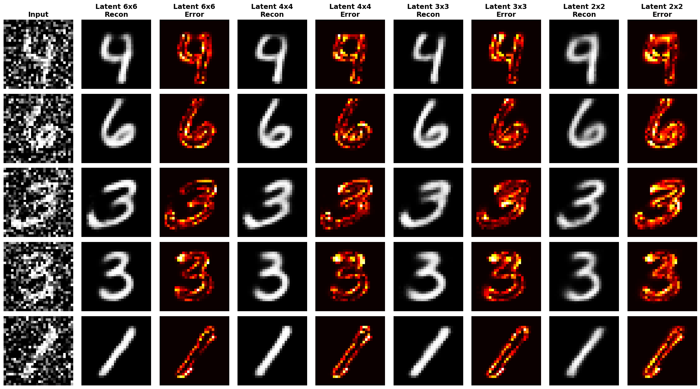
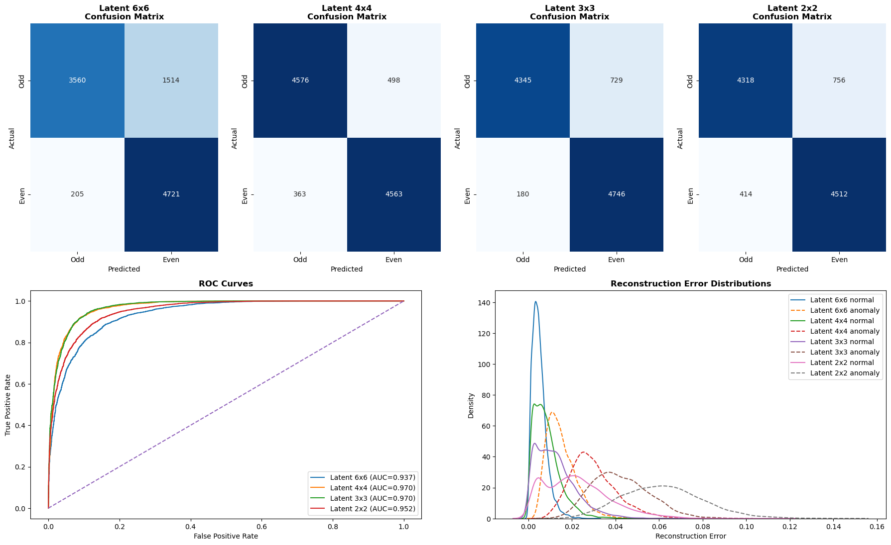

# Autoencoders From Scratch
A hands-on deep learning project building autoencoders from scratch for data reconstruction, data denoising and anomaly detection.

## Project Overview
This repository explores how autoencoders learn to compress and reconstruct data, and what this ability can be used for.

The project includes:
* Implementation of three autoencoder models from scratch.
* Weight tying logic for mirrored layers.
* Comparison across multiple networks with different latent sizes.
* Grid search for thresholds in anomaly detector model.
* Error heatmaps, anomaly detection confusion matrices, ROC curve plots, reconstruction error distribution plots.

## Dataset
- **MNIST**: 70,000 images of hand-written digits (28×28 pixels)
- **Normalization**: Pixel values scaled to [0, 1]

## Models Implemented
The following autoencoder models were implemented with **6x6**, **4x4**, **3x3** and **2x2** latent sizes:
* **Image Reconstructor:** Compresses the images into a latent space and tries to reconstruct them back, using the input as the target.
* **Image Denoiser:** Compresses noisy versions of the images into a latent space and tries to reconstruct the original images back. The compression learns to keep only the most useful features and to ignore the noise.
* **Anomaly Detector:** Trains the compression and reconstruction only on odd number images. When an even number is inputted, the reconstruction error is high and the model flags it as an anomaly.

## Experiments and Visualizations

### 1. Layer Flow Visualization
Plotted the flow of the images across all of the autoencoder layers for different latent layer sizes.

### 2. Reconstruction Comparisons
Side by side comparisons of the image reconstructions were plotted for different latent layer sizes, along with error heatmaps.

### 3. Anomaly Detection Metrics
Confusion matrices, ROC curves and reconstruction error distributions were plotted for the anomaly detection networks.

## Results Summary
This project highlights how autoencoers behave when applied to different problems with different latent sizes:

* For simple image compression and reconstruction, most models performed well, but the ones with **3x3** and **2x2** latent sizes struggled with similar numbers like 3/8, 4/9 and 5/6.
* The same pattern was observed when applying the models to image denoising tasks. Some images became so abstract that even **4x4** latent sizes couldn't denoise them properly.
* For anomaly detection, a larger latent size of **6x6** was actually worse, because the reconstruction error was low even for the abnormal samples.
* The latent sizes of **4x4** and **3x3** performed reasonably well on most scenarios, offering the best balance between layer size and accuracy.

### Usage
1. Clone the repository
2. Run the notebooks
3. Play with the hyperparameters and visualizations

**Author**: Daniel Pederzini  
**Purpose**: Machine Learning Educational Project
